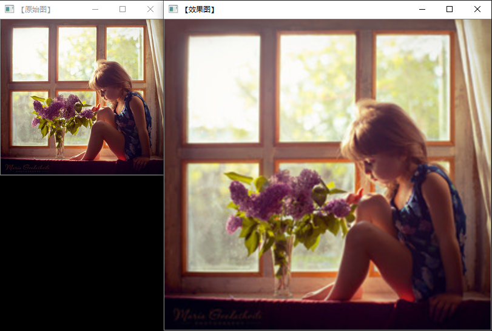

##### 1.图像金子塔

图像金字塔是**图像中多尺度表达**的一种，最主要用于**图像的分割**，是一种**以多分辨率来解释图像的有效但概念简单的结构**。

图像金字塔最初用于机器视觉和图像压缩，**一幅图像的金字塔是一系列以金字塔形状排列的分辨率逐步降低，且来源于同一张原始图的图像集合**。其通过梯次向下采样获得，直到达到某个终止条件才停止采样。

金字塔的底部是待处理图像的高分辨率表示，而顶部是低分辨率的近似。

一般情况下有两种类型的图像金字塔常常出现在文献和以及实际运用中。他们分别是:

　　**●高斯金字塔**(Gaussianpyramid): 用来向下采样，主要的图像金字塔
　　**●拉普拉斯金字塔**(Laplacianpyramid): 用来从金字塔低层图像重建上层未采样图像，在数字图像处理中也即是预测残差，可以对图像进行最大程度的还原，配合高斯金字塔一起使用。

​       **●对图像向上采样**：pyrUp函数
　　**●对图像向下采样**：pyrDown函数

```
    //上采样
	Mat srcImage = imread("1.jpg");  
	Mat tmpImage, dstImage;
	tmpImage = srcImage;					
	imshow("【原始图】", srcImage);
	//进行向上取样操作
	pyrUp(tmpImage, dstImage, Size(tmpImage.cols * 2, tmpImage.rows * 2));
	//显示效果图  
	imshow("【效果图】", dstImage);
```



<center>效果对比图</center>

```
    //下采样
    Mat srcImage = imread("1.jpg");  
	Mat tmpImage, dstImage;
	tmpImage = srcImage;
	imshow("【原始图】", srcImage);
	//进行向下取样操作
	pyrDown(tmpImage, dstImage, Size(tmpImage.cols / 2, tmpImage.rows / 2));
	//显示效果图  
	imshow("【效果图】", dstImage);
```

##### 2.图像尺寸缩放

opencv中对图像按指定尺寸缩小或放大，主要是采用：

void resize(InputArray src, OutputArray dst, Size dsize, double fx=0, double fy=0, int interpolation=INTER_LINEAR )

参数含义：
InputArray src     -原图像
OutputArray dst    -输出图像
Size dsize         -目标图像的大小
double fx=0        -在x轴上的缩放比例
double fy=0        -在y轴上的缩放比例
int interpolation  -插值方式，有以下四种方式
     INTER_NN      -最近邻插值
     INTER_LINEAR  -双线性插值 (缺省使用)
     INTER_AREA    -使用象素关系重采样，当图像缩小时候，该方法可以避免波纹出现。当图像放大时，类似于 INTER_NN 方法。
     INTER_CUBIC   -立方插值。

```
    Mat srcImage = imread("1.jpg");
    Mat dstImage1, dstImage2;
//进行尺寸调整操作
	resize(tmpImage, dstImage1, Size(tmpImage.cols / 2, tmpImage.rows / 2), (0, 0), (0, 0), 3);
	resize(tmpImage, dstImage2, Size(tmpImage.cols * 2, tmpImage.rows * 2), (0, 0), (0, 0), 3);
```


<center>原图</center>


<center>缩放图</center>


<center>放大图</center>