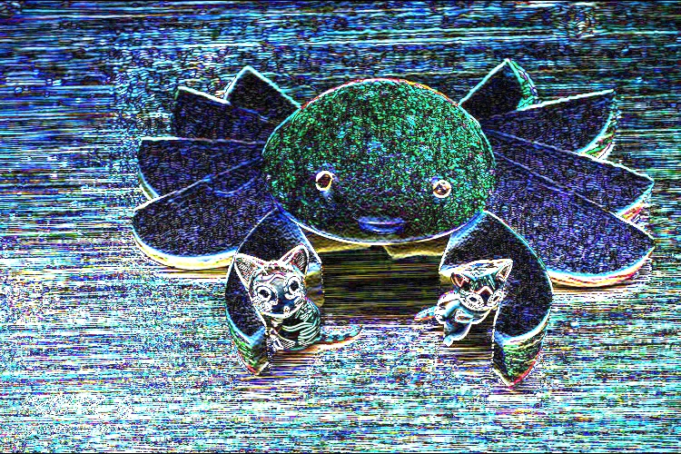

##### 1.边缘检测的一般步骤

滤波：边缘检测算法主要是基于图像强度的一阶和二阶导数，但是导数对于噪声很敏感，因此需要采用滤波器来改善与噪声有关的边缘检测器的性能
增强：增强边缘的基础是确定图像各点邻域强度的变化值。增强算法可以将灰度点邻域强度值有显著变化的点凸显出来
检测：邻域中有很多的点的梯度值较大，但是在特定的应用中，这些点并不是要找的边缘点，需要取舍

##### 2. canny算子

canny边缘检测算子是1986年开发出来的一个多级边缘检测算法。Canny的目标是找到一个最优的边缘检测算法，主要有三个主要评价标准:

- 低错误率：标识出尽可能多的实际边缘，同时尽可能地减少噪声产生的误报。
- 高定位性：标识出的边缘要与图像中的实际边缘尽可能接近
- 最小响应：图像中的边缘只能标识一次，并且可能存在的图像噪声不应标识为边缘

Canny边缘检测的步骤:

（1）消除噪声
（2）计算梯度幅值和方向
（3）非极大值抑制

排除非边缘像素，仅仅保留一些细线条

   (4)   滞后阈值
若某一像素位置的幅值超过高阈值，该像素被保留为边缘像素
若某一像素位置的幅值小于低阈值，该像素被排除
若某一像素位置的幅值在两个阈值之间，该像素仅仅在连接一个高于高阈值的像素时被保留

```
void Canny(InputArray image, OutputArray edges, double threshold,double threshold2,int apertureSize = 3,bool L2gradient = false)
```

第三个参数：double 类型的threshold1,第一个滞后性阈值
第四个参数：double类型的threshold2，第二个滞后性阈值
第五个参数：int类型的apertureSize，表示应用Sobel算子的孔径大小，默认值为3
第六个参数：bool类型的L2gradient，一个计算图像梯度幅值的标识，默认值false

```
    //载入原始图  
	Mat srcImage = imread("1.jpg"); 
	Mat srcImage1 = srcImage.clone();

	//显示原始图 
	imshow("【原始图】Canny边缘检测", srcImage);
	//转成灰度图，降噪，用canny，最后将得到的边缘作为掩码，拷贝原图到效果图上，得到彩色的边缘图

	Mat dstImage, edge, grayImage;
	// 【1】创建与src同类型和大小的矩阵(dst)
	dstImage.create(srcImage1.size(), srcImage1.type());
	// 【2】将原图像转换为灰度图像
	cvtColor(srcImage1, grayImage, COLOR_BGR2GRAY);
	// 【3】先用使用 3x3内核来降噪
	blur(grayImage, edge, Size(3, 3));
	// 【4】运行Canny算子
	Canny(edge, edge, 3, 9, 3);
	//【5】将g_dstImage内的所有元素设置为0 
	dstImage = Scalar::all(0);
	//【6】使用Canny算子输出的边缘图g_cannyDetectedEdges作为掩码，来将原图g_srcImage拷到目标图g_dstImage中
	srcImage1.copyTo(dstImage, edge);
	//【7】显示效果图 
	imshow("【效果图】Canny边缘检测2", dstImage);
```

<figure class="center">
     
    
</figure>

##### 3.sobel算子

Sobel算子是一个主要用于边缘检测的离散微分算子(discrete differentiation operator)，它结合高斯平滑和微分求导。用来计算图像灰度函数的近似函数。

```
void Sobel(inputArray,outputArray,int ddepth,int dx,int dy,int ksize=3,double scale=1,double delta=0,int borderType=BORDER_DEFAULT)
```

第一个参数，输入图像。
第二个参数，输出图像。
第三个参数，输出图像深度。
第四个参数，x方向上的差分阶数。
第五个参数，y方向上的差分阶数。
第六个参数，Sobel核的大小，默认值为3，必须为1、3、5、7。当为1时，往往使用3x1、1x3的内核，这种情况下，没有进行高斯平滑操作。
第七个参数，计算导数值时可选的缩放因子，默认值1，表示默认情况下没用应用缩放。
第八个参数，表示在结果存入输出图像之前可选的delta值，默认值0。
第九个参数，边界模式。

```
    //【0】创建 grad_x 和 grad_y 矩阵
	Mat grad_x, grad_y;
	Mat abs_grad_x, abs_grad_y, dst;

	//【1】载入原始图  
	Mat src = imread("1.jpg"); 
	//【2】显示原始图 
	imshow("【原始图】sobel边缘检测", src);

	//【3】求 X方向梯度
	Sobel(src, grad_x, CV_16S, 1, 0, 3, 1, 1, BORDER_DEFAULT);
	convertScaleAbs(grad_x, abs_grad_x);
	imshow("【效果图】 X方向Sobel", abs_grad_x);
	//【4】求Y方向梯度
	Sobel(src, grad_y, CV_16S, 0, 1, 3, 1, 1, BORDER_DEFAULT);
	convertScaleAbs(grad_y, abs_grad_y);
	imshow("【效果图】Y方向Sobel", abs_grad_y);	
	//【5】合并梯度(近似)
	addWeighted(abs_grad_x, 0.5, abs_grad_y, 0.5, 0, dst);
	imshow("【效果图】整体方向Sobel", dst);
	waitKey(0);
```

<figure class="half">
     
    
    
    
</figure>

##### 4.拉普拉斯变换

```
#include <opencv2/opencv.hpp>
#include<opencv2/highgui/highgui.hpp>
#include<opencv2/imgproc/imgproc.hpp>
using namespace cv;


int main()
{
	//【0】变量的定义
	Mat src, src_gray, dst, abs_dst;

	//【1】载入原始图  
	src = imread("1.jpg");  //工程目录下应该有一张名为1.jpg的素材图

							//【2】显示原始图 
	imshow("【原始图】图像Laplace变换", src);

	//【3】使用高斯滤波消除噪声
	GaussianBlur(src, src, Size(3, 3), 0, 0, BORDER_DEFAULT);

	//【4】转换为灰度图
	cvtColor(src, src_gray, COLOR_RGB2GRAY);
	imwrite("gray.jpg", src_gray);

	//【5】使用Laplace函数
	Laplacian(src_gray, dst, CV_16S, 3, 1, 0, BORDER_DEFAULT);

	//【6】计算绝对值，并将结果转换成8位
	convertScaleAbs(dst, abs_dst);

	//【7】显示效果图
	imshow("【效果图】图像Laplace变换", abs_dst);
	imwrite("Laplace_dst.jpg", abs_dst);

	waitKey(0);

	return 0;
}
```

<figure class="half">
     
    
    
</figure>

##### 5. scharr 滤波器

```
#include <opencv2/opencv.hpp>
#include<opencv2/highgui/highgui.hpp>
#include<opencv2/imgproc/imgproc.hpp>
using namespace cv;


int main()
{
	//【0】创建 grad_x 和 grad_y 矩阵
	Mat grad_x, grad_y;
	Mat abs_grad_x, abs_grad_y, dst;

	//【1】载入原始图  
	Mat src = imread("1.jpg");  //工程目录下应该有一张名为1.jpg的素材图

								//【2】显示原始图 
	imshow("【原始图】Scharr滤波器", src);

	//【3】求 X方向梯度
	Scharr(src, grad_x, CV_16S, 1, 0, 1, 0, BORDER_DEFAULT);
	convertScaleAbs(grad_x, abs_grad_x);
	imshow("【效果图】 X方向Scharr", abs_grad_x);
	imwrite("abs_grad_x.jpg", abs_grad_x);

	//【4】求Y方向梯度
	Scharr(src, grad_y, CV_16S, 0, 1, 1, 0, BORDER_DEFAULT);
	convertScaleAbs(grad_y, abs_grad_y);
	imshow("【效果图】Y方向Scharr", abs_grad_y);
	imwrite("abs_grad_y.jpg", abs_grad_y);

	//【5】合并梯度(近似)
	addWeighted(abs_grad_x, 0.5, abs_grad_y, 0.5, 0, dst);
	imwrite("Scharr_dst.jpg", dst);
	//【6】显示效果图
	imshow("【效果图】合并梯度后Scharr", dst);

	waitKey(0);
	return 0;
}
```

<figure class="half">
     
    
    
    
</figure>

